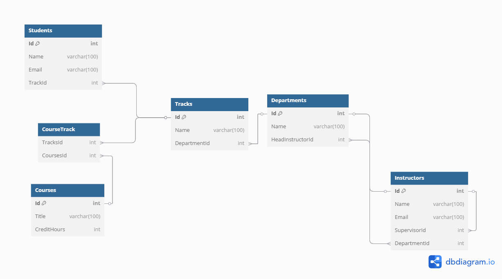

# EF Core Playground

This repository is a playground for Entity Framework Core. It contains a simple console application that demonstrates how to use EF Core to interact with a SQLServer database.

## Overview

In this project, I try to practice the following concepts:

- How to use EF Core with SQLServer, in DB First approach. (Look at this project: [EFPlayground/DbFirst](./EFPlayground/DbFirst/))
- How to use EF Core with SQLServer, in Code First approach.
  - Using Data Annotations (Look at this project: [EFPlayground/CFDataAnnotations](./EFPlayground/CFDataAnnotations/)
  - Using Fluent API (Look at this project: [EFPlayground/CFFluentAPI](./EFPlayground/CFFluentAPI/))

### Database Schema

Look at the database schema using `DBML` file [here](./docs/database.dbml)



> [!Note]
>
> There is another approach for this design to create parent table for `Student` and `Instructor` tables, and use `Discriminator` column to differentiate between them. But I wanted to keep it simple and separate them.

## How to run

1. Clone this repository

   ```bash
   git clone <repo_url>
   ```

2. Open the solution file in Visual Studio

3. In `Config` Project, Copy `app.settings.example.json` and Create `app.settings.json` file in the same directory and fill in the connection string.

4. Restore the NuGet packages, by right-clicking on the solution and selecting `Restore NuGet Packages`.

5. Build the solution.

6. Run the console application project you want to run.

> [!Note]
>
> if you want to run the `DbFirst` project, you need to create a database first (using the scripts provided in the `scripts` directory) and update the connection string in the `app.settings.json` file.

## File Structure

```bash
EFPlayground
├── EFPlayground.sln
├── Config
│   ├── app.settings.example.json
│   ├── app.settings.json
├── DbFirst
│   ├── Program.cs
├── CFDataAnnotations
│   ├── Program.cs
│   ├── Models
│   │   ├── Student.cs
│   ├── Database
│   │   ├── SchoolDbContext.cs
├── CFFluentAPI
│   ├── Program.cs
│   ├── ModelConfigurations
│   │   ├── StudentConfiguration.cs
│   ├── Models
│   │   ├── Student.cs
│   ├── Database
│   │   ├── SchoolDbContext.cs
├── docs
│   ├── database.dbml
│   ├── erd.png
├── scripts
│   ├── create_db.sql
│   ├── populate_db.sql
├── .gitignore
├── README.md
```
